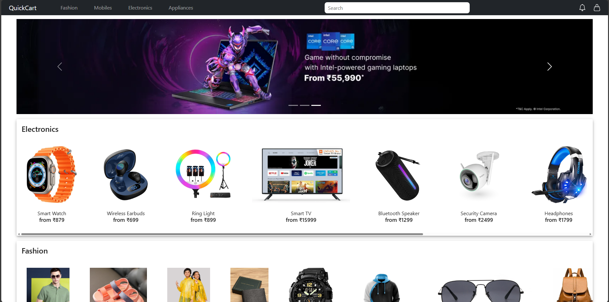
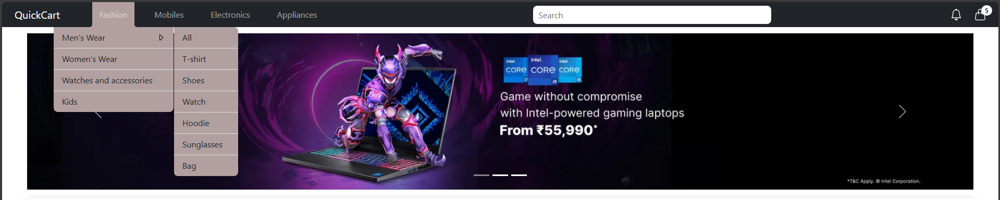
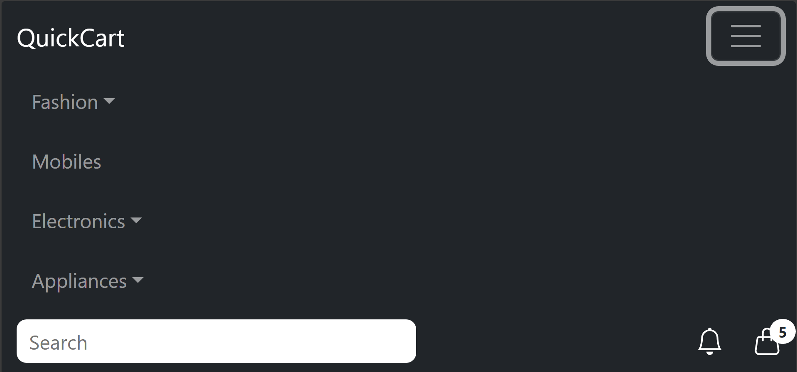

# QuickCart – Modern E-Commerce Web App 🛒

[Live Demo 🚀](https://quickcart-ecommerce-one.vercel.app/)

QuickCart is a responsive and dynamic e-commerce website built using **React**, **Vite**, **Material-UI**, and **Bootstrap 5**. It features real-world functionality such as product search, filtering, detailed views, cart management, and user feedback — designed to demonstrate real-world frontend development skills, making it a strong addition to any portfolio or production-ready store.

---

## 🔥 Features

* 🏍️ Product browsing with category, brand, and rating filters
* 🧠 Intelligent recommendations and similar items
* 🔍 Search bar with keyword-based filtering
* 🛒 Shopping cart with quantity control
* 💸 Discount calculation and pricing breakdown
* 📜 Responsive design for desktop & mobile
* 🔔 Snackbar alerts on cart updates
* 📢 Rotating ad banners for promotions
* ⚡ Page scroll resets on route change
* 🧩 Cart data persists on page refresh using localStorage
---

## 🛠️ Tech Stack

* **Frontend:** React, Vite
* **Styling:** Material-UI, Bootstrap 5, Custom CSS
* **State Management:** React Context API
* **Routing:** React Router v7+
* **Notifications:** Notistack
* **Deployment:** Vercel

---

## 🚀 Getting Started

Clone the repo and install dependencies:

```bash
git clone https://github.com/YOUR_USERNAME/quickcart.git
cd quickcart-ecommerce
npm install
npm run dev
```

To build and preview production locally:

```bash
npm run build
npm run preview
```

---

## 📀 Folder Structure

```
quickcart/
├── public/
│   └── screenshots/             # UI screenshots for documentation
│
├── src/
│   ├── appRoutes/              # Centralized routing definitions
│   ├── components/             # Reusable UI components (advertisement Banner, Footer, etc.)
│   ├── context/                # Context API for state management
│   ├── others/                 # SnackBar, EmptyCart, etc.
│   ├── pages/                  # Page-level components (Home, Cart, Navbar, DetailPage, etc.)
│   ├── utils/                  # Utility functions (localStorage helpers, Data.js etc.)
│   ├── App.jsx                 # Root component
│   ├── main.jsx                # Entry point
│   └── index.css               # Global styles
│
├── .gitignore
├── index.html
├── package.json
├── package-lock.json
├── vite.config.js
├── eslint.config.js
└── README.md
```

---

## 📸 Screenshots

### 🏠 Homepage


### 🔍 Search Page


### 🧾 Cart Page


### 🧩 Detail Page


### 📌 Navbar



### 🔄 Related Items


---

## 🤝 Acknowledgements

This project was built as part of my portfolio to demonstrate proficiency in React-based frontend development, UI/UX, and responsive e-commerce interfaces.

---

## 🔗 License

This project is open-source and available under the [MIT License](LICENSE).
MIT License

Copyright (c) 2025 Pandarinath Guptha Inuguri

Permission is hereby granted, free of charge, to any person obtaining a copy...
